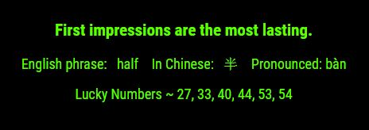
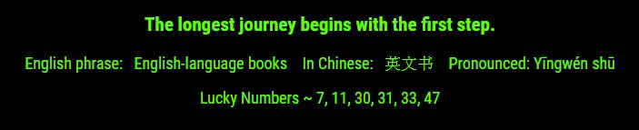
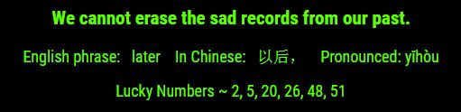

# MMM-Fortune
A MagicMirror module that gives you free Fortune Cookie fortunes.

## Examples

* maxWidth: 100%, colored title text. Editable text sizes and colors. top/bottom_bar, upper/lower_third, middle_center.

## Fortunes are fun!
Fortunes exactly as you would find them inside a Fortune Cookie. Words of wisdom first. Then a phrase in English, followed by the phrase in Chinese lettering and the pronunciation. Lastly, lucky lottery numbers ranging from 0 to 59, coninciding with US Powerball numbers. No one has ever won the Powerball using the numbers from a fortune cookie. Will you be the first?

## Info

* The .css file included helps you modify size and color of text.
* For best results in top_bar/bottom_bar/thirds set maxWidth: "100%" to stretch across your mirror and modify size and color of text in the css file.
* Need a color chart? No problem. http://htmlcolorcodes.com/color-picker/
* No API key is necessary at the moment.

## Installation

* `git clone https://github.com/mykle1/MMM-Fortune.git` into the `~/MagicMirror/modules` directory.
* `cd MMM-Fortune`
* `npm install`

## Add to Config.js

    {
        module: "MMM-Fortune",
        position: "lower_third",
        config: {
            maxWidth: "100%",    
            header: ""
        }
    },

## Config Options

| **Option** | **Default** | **Description** |
| --- | --- | --- |
| `maxWidth` | `100%` | Stretch across top_bar,bottom_bar, thirds. |
| `header` | `text` | I'm not a fan of headers but the option is yours. |
| `animationSpeed` | `3000` | The speed at which the new Fortune fades in ms. |
| `updateInterval` | `60*60*1000` | 1 hour. |
| `initialLoadDelay` | `1250` | Module load delay in ms. |
| `retryDelay` | `2500`  |Delay to retry fetching data. |
